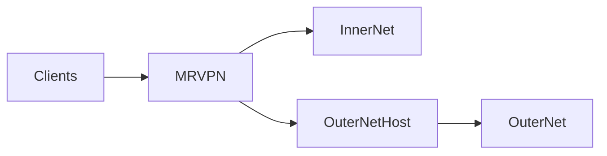

# The MultiRoute VPN

When the internet split into outernet and innernet, it is not enough to have a VPN to reach the outernet. 
When client vpns the outernet, you don't have access to some innernet sites and vice versa.
The MultiRoute VPN is a tool to solve this.



## Routing decisions
The routing decision is made on DNS and IP information. When the client resolves the DNS name for some host, 
the request is intercepted by the recursor. Before sending the answer to the client, the recursor 
decides where the later traffic should go and applies the appropriate routing to the subnet/IP. 
When packets start flowing, they get routed properly. 

Sometimes, when complex CNAME chains are used for the hosts, the routing information is applied 
after the client receives the IP address (ozon.ru is an example). In this case, two possible solutions can be used:

1. Specify IP in the subnets list.
2. Flush DNS cache and retry the navigation.


## Deployment
The MRVPN is deployed as an ansible role. The 2 hosts are needed for the deployment : 
1. Entry point host, which includes:
   1. FireZone (the WireGuard solution)
   2. Docker to server everything:
      1. WireGuard client to the outernet upstream.
      2. IPT Server: the routing decision daemon.
      3. PowerDNS Recursor to handle and hook DNS requests
2. Outernet host with WireGuard daemon.

### Basic deployment config:
```yaml
- hosts: localhost
  gather_facts: no
  become: no
  tasks:
    - name: run ssh-keyscan to add keys to known_hosts
      shell: ssh-keyscan {{hostvars.entrypoint_host.ansible_host}} >> ~/.ssh/known_hosts
      # add firezone-ctl reconfigure
      # todo: add option to route all traffic through vpn not only tcp
      #todo: check if firezone installed (can be checked by admin password file not empty)
#certbot certonly -d vpn.xxl.cx --standalone --pre-hook "firezone-ctl stop" --post-hook "firezone-ctl start"
- hosts: entrypoint_host


  roles:
    - role: mrvpn
      vars:
        # The entrypoint hostname for FireZone
        server_url: "mrvpn.entrypoint_host"

        wireguard_config: |
          [Interface]
          PrivateKey = ##############################################################
          Address = 10.3.2.36/32,fd00::3:2:24/128
          DNS = 1.1.1.1, 1.0.0.1
          PostUp = iptables -t nat -A POSTROUTING -o mrvpn-wg-outer -j MASQUERADE
          PostDown = iptables -t nat -D POSTROUTING -o mrvpn-wg-outer -j MASQUERADE
          Table = 11

          [Peer]
          PublicKey = ##############################################################
          PresharedKey = ##############################################################
          AllowedIPs = 10.3.2.1/32, 10.3.2.36/32, 1.0.0.0/8, 2.0.0.0/7, 4.0.0.0/6, 8.0.0.0/7, 11.0.0.0/8, 12.0.0.0/6, 16.0.0.0/4, 32.0.0.0/3, 64.0.0.0/3, 96.0.0.0/4, 112.0.0.0/5, 120.0.0.0/6, 124.0.0.0/7, 126.0.0.0/8, 128.0.0.0/3, 160.0.0.0/5, 168.0.0.0/8, 169.0.0.0/9, 169.128.0.0/10, 169.192.0.0/11, 169.224.0.0/12, 169.240.0.0/13, 169.248.0.0/14, 169.252.0.0/15, 169.255.0.0/16, 170.0.0.0/7, 172.0.0.0/12, 172.32.0.0/11, 172.64.0.0/10, 172.128.0.0/9, 173.0.0.0/8, 174.0.0.0/7, 176.0.0.0/4, 192.0.0.0/9, 192.128.0.0/11, 192.160.0.0/13, 192.169.0.0/16, 192.170.0.0/15, 192.172.0.0/14, 192.176.0.0/12, 192.192.0.0/10, 193.0.0.0/8, 194.0.0.0/7, 196.0.0.0/6, 200.0.0.0/5, 208.0.0.0/4, 224.0.0.0/4, ::/1, 8000::/2, c000::/3, e000::/4, f000::/5, f800::/6, fe00::/9, fec0::/10, ff00::/8
          Endpoint = mrvpn.entrypoint_host:51820
          PersistentKeepalive = 0
        firezone_config: |
# uncomment if you want to use the google authentication    
#          default['firezone']['authentication']['oidc'] = {
#            google: {
#              discovery_document_uri: "https://accounts.google.com/.well-known/openid-configuration",
#              client_id: "############################################",
#              client_secret: "############################################",
#              redirect_uri: "https://{{server_url}}/auth/oidc/google/callback/",
#              response_type: "code",
#              scope: "openid email profile",
#              label: "Google"
#            }
#          }                            
          default['firezone']['ssl']['certificate'] = '/etc/letsencrypt/live/{{server_url}}/fullchain.pem'
          default['firezone']['ssl']['certificate_key'] = '/etc/letsencrypt/live/{{server_url}}/privkey.pem'
# uncomment if you want to restore the letsencrypt certificates from backup
#        letsencrypt:
#          cert: /home/user/vpn_backup/certs/mrvpn.entrypoint_host/cert1.pem
#          chain: /home/user/vpn_backup/certs/mrvpn.entrypoint_host/chain1.pem
#          fullchain: /home/user/vpn_backup/certs/mrvpn.entrypoint_host/fullchain1.pem
#          privkey: /home/user/vpn_backup/certs/mrvpn.entrypoint_host/privkey1.pem
# uncomment to redeploy the firezone
#        firezone_redeploy: True
```
### Prerequisites
1. The debian/ubuntu for the entrypoint host
2. Install ansible requirements with: ```ansible-galaxy install -r requirements.yml```

### Advanced configuration options:

```yaml
# Firezone admin email
firezone_admin: "no@email.com"
# Outernet host subnet where client's IP addresses will be allocated
vpn_subnet: "10.8.2.0/24"
# The IP of the Outernet WireGuard host
vpn_host: "10.8.2.1"
# The docker subnet for infrastructure services
docker_subnet: "10.5.0"
# Routing table num to handle PBR
route_table_num: 11
# Countries which will be routed to the innernet route
countries:
  - 'RU'
  - 'AM'
# Pre-defined regexps of the domains to route them to the innernet
# Note the trailing dot.
domains:
  - '^.*\.ru\.$'
  - '^.*ozon\.travel\.$'
# Also can be fetched from the url
domain_lists:
  - https://raw.githubusercontent.com/AlexMKX/mrvpnconfig/main/domains.txt


# Subnets and hosts to be routed to the innernet
subnets:
  - '195.34.20.248'
# Hosts also can be fetched from the url 
subnet_lists:
  - https://raw.githubusercontent.com/AlexMKX/mrvpnconfig/main/subnets.txt

# Additional firezone config. Probably you want to enable SAML for clients
firezone_config: |
  # default['firezone']['authentication']['google']['enabled'] = false
  # default['firezone']['authentication']['google']['client_id'] = nil
  # default['firezone']['authentication']['google']['client_secret'] = nil
  # default['firezone']['authentication']['google']['redirect_uri'] = nil

# Force FireZone redeploy on each deployment
firezone_redeploy: False

# Where services will reside
target_dir: /srv/mrvpn
```

After role deployment is done, you can find the FireZone credentials in the ```target_dir/firezone_admin_password```
To reset, or, actually, recover admin password - set the firezone_redeploy to True and run role deployment again

